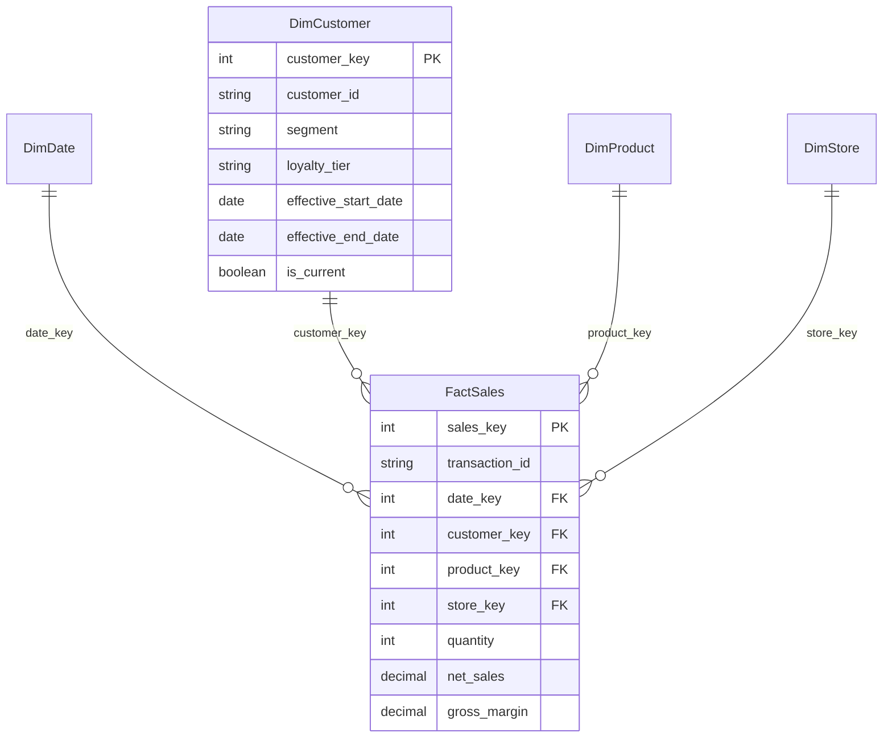

# Retail Sales Analytics Pipeline

An end-to-end retail analytics project using Python, SQL warehouse design, PySpark reference code, and Power BI-ready reporting marts.

## What This Project Demonstrates

- Multi-location retail sales ingestion from daily CSV drops.
- Star schema warehouse design with `FactSales`, `DimCustomer`, `DimProduct`, `DimStore`, and `DimDate`.
- Incremental loading through a file audit table.
- Data validation with rejected-row logging.
- Type 2 customer history tracking for segment and loyalty changes.
- Indexed SQL warehouse scripts for PostgreSQL and SQL Server.
- Power BI-ready mart exports for sales trends, customer segmentation, and inventory analysis.

## Project Structure

```text
data/raw/                     Source retail data files
src/run_pipeline.py            Local runnable ETL pipeline
src/run_pyspark_pipeline.py    PySpark reference implementation
sql/                           PostgreSQL, SQL Server, and reporting SQL
powerbi/dashboard_guide.md     Power BI report build guide
outputs/                       Generated local warehouse and marts
```

Generated files are written to:

```text
outputs/retail_sales_warehouse.sqlite
outputs/marts/
```

## Run Locally

From the repository root:

```bash
python3 src/run_pipeline.py
```

The local run uses SQLite so it works without installing PostgreSQL, SQL Server, pandas, or PySpark.

## Quick Start

```bash
git clone <your-repo-url>
cd retail-sales-analytics-pipeline
python3 src/run_pipeline.py
```

After the run, open the generated CSVs in `outputs/marts` or connect Power BI to those files.

## Source Data

The sample data models two daily drops:

- `customers_2026_06_28.csv`
- `customers_2026_06_29.csv`
- `sales_2026_06_28.csv`
- `sales_2026_06_29.csv`

One customer changes segment and loyalty tier on `2026-06-29`, creating a new `DimCustomer` history record. The second sales file also includes invalid rows so validation can reject them and preserve auditability.

## Warehouse Model



## Incremental Load Behavior

Each source file is recorded in `etl_loaded_files` after processing. Re-running the pipeline skips files that were already loaded, which prevents duplicate fact rows.

Invalid sales records are stored in `etl_rejections` with the file name, transaction id, reason, and rejection timestamp.

## Power BI Outputs

The pipeline exports three business-friendly CSV marts:

- `sales_trends.csv`
- `customer_segments.csv`
- `inventory_analysis.csv`

See `powerbi/dashboard_guide.md` for recommended dashboard pages and visuals.

## Production Notes

- Use `sql/postgres_schema.sql` for PostgreSQL deployments.
- Use `sql/sql_server_schema.sql` for SQL Server deployments.
- Use `src/run_pyspark_pipeline.py` as the Spark/JDBC reference for larger file volumes.
- Schedule ingestion with Airflow, cron, SQL Server Agent, or a cloud scheduler.
- Store database credentials in environment variables or a secrets manager.
