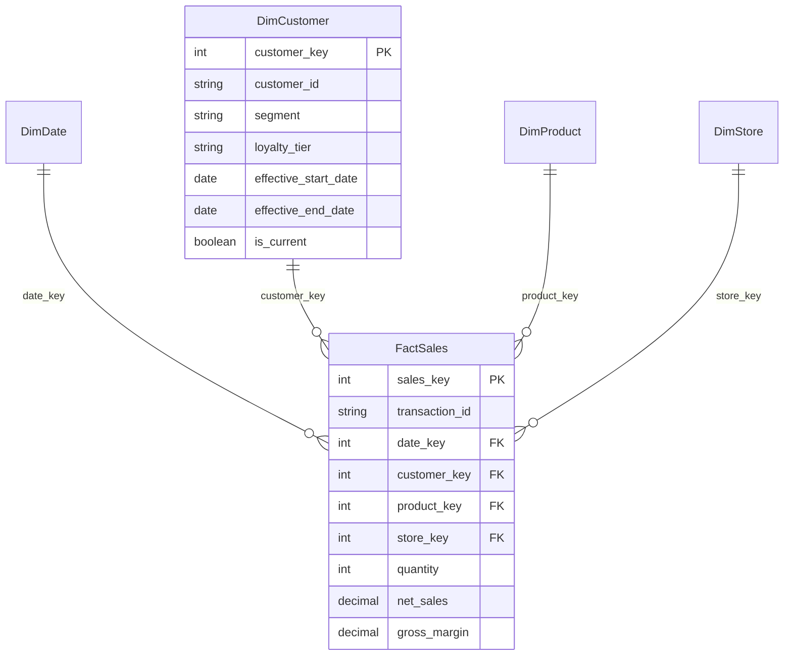

# Retail Sales Analytics Pipeline

Retail sales ETL project that loads daily transaction files into a small star-schema warehouse. The local version runs with Python and SQLite so the pipeline can be tested without a database server. SQL scripts are included for PostgreSQL and SQL Server.

## Features

- Loads sales, customer, product, and store CSV files from multiple locations.
- Builds a star schema with `FactSales`, `DimCustomer`, `DimProduct`, `DimStore`, and `DimDate`.
- Tracks loaded files to avoid duplicate processing.
- Validates incoming sales records and stores rejected rows with a reason.
- Keeps customer segment and loyalty changes using type 2 history.
- Exports simple reporting datasets for sales trends, customer segments, and product performance.

## Project Structure

```text
data/raw/                     Source retail data files
src/run_pipeline.py            Local runnable ETL pipeline
src/run_pyspark_pipeline.py    Spark version for larger file loads
sql/                           PostgreSQL, SQL Server, and reporting SQL
powerbi/dashboard_guide.md     Power BI report build guide
outputs/                       Generated warehouse and reporting files
```

Generated files are written to:

```text
outputs/retail_sales_warehouse.sqlite
outputs/marts/
```

## Run Locally

From the repository root:

```bash
python3 src/run_pipeline.py
```

The local run uses SQLite and Python's standard library. PostgreSQL, SQL Server, pandas, and PySpark are not required for the first run.

## Quick Start

```bash
python3 src/run_pipeline.py
```

After the run, use the CSVs in `outputs/marts` for reporting or Power BI import.

## Source Data

The sample data includes two daily file drops:

- `customers_2026_06_28.csv`
- `customers_2026_06_29.csv`
- `sales_2026_06_28.csv`
- `sales_2026_06_29.csv`

One customer changes segment and loyalty tier on `2026-06-29`, which creates a new `DimCustomer` version. The second sales file also contains invalid rows so the validation and rejection flow can be tested.

## Warehouse Model



## Incremental Load Behavior

Each source file is recorded in `etl_loaded_files` after processing. Re-running the pipeline skips files that were already loaded, which prevents duplicate fact rows.

Invalid sales records are stored in `etl_rejections` with the file name, transaction id, reason, and rejection timestamp.

## Reporting Outputs

The pipeline exports three CSV datasets:

- `sales_trends.csv`
- `customer_segments.csv`
- `inventory_analysis.csv`

See `powerbi/dashboard_guide.md` for recommended dashboard pages and visuals.

## Validation Run

The latest local row counts and rejection totals are documented in `TEST_RESULTS.md`.

## Production Notes

- Use `sql/postgres_schema.sql` for PostgreSQL deployments.
- Use `sql/sql_server_schema.sql` for SQL Server deployments.
- Use `src/run_pyspark_pipeline.py` as a Spark/JDBC version for larger file volumes.
- Schedule ingestion with Airflow, cron, SQL Server Agent, or a cloud scheduler.
- Store database credentials in environment variables or a secrets manager.
